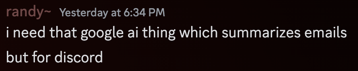
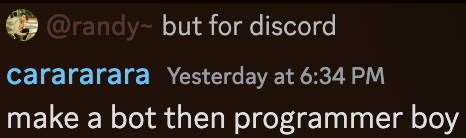

# Discord Conversation Summarizer w/ AI

By Randy

# Why?




# Docker Container? (Easiest Way)

```sh
docker pull ghcr.io/randy-halim/discord-ai-conversation-summary:latest

# copy ".env.example" from the repo to your current working directory as ".env"
# fill out ".env" with your keys as needed

docker run -d \
  --env-file .env \
  ghcr.io/randy-halim/discord-ai-conversation-summary:latest --register

# profit
```

## (outdated Quick Start)

1. Clone this repo
2. Install Node v19.x and npm
3. Run `pnpm install`
4. Copy the `.env.example` file to `.env`, fill out the needed values
5. Run `pnpm run start:register` to register commands
6. Profit

# License

[MIT License](https://fcrh.mit-license.org/)
